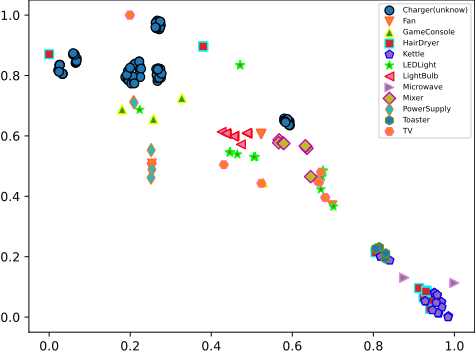
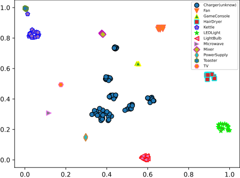

# Unknown Load Detection for Non-Intrusive Load Monitoring 

## Overview

Paper Todo list

## Datasets

We evaluated the DC-LUNAR model using  two public datasets, PLAID2017 and WHITEDv1.1. To obtain these datasets, you can download as follow

### Manual download:

You can manually download the datasets using the provided link and place them into the pre-made directory.

PLAID2017 [PLAID 2017 (figshare.com)](https://figshare.com/articles/dataset/PLAID_2017/11605215?file=21003861)

WHITED [WHITED - Decentralized Information Systems and Data Management (tum.de)](https://www.cs.cit.tum.de/dis/resources/whited/)

## Setup

_Instructions refer to Unix-based systems (e.g. Linux, MacOS)._

This code has been tested with `Python 3.7` and `3.8`.

`pip install -r requirements.txt`

## Run

To see all command options with explanations, run: `python main.py --help`
In `main.py` you can select the datasets and modify the model parameters.
For example:

`python main.py --epochs 1500 `

## Results

### Only know appliances

#### WHITED

#### PLAID2017

### Consider the scenario of an unknown electrical appliance

detail in paper（TODO ）

### Consider the scenario of multiple unknown electrical appliance

detail in paper（TODO ）

### Graph

T-sne for Origin sequence(2D)

T-sne for Feature embedding sequence(2D)

